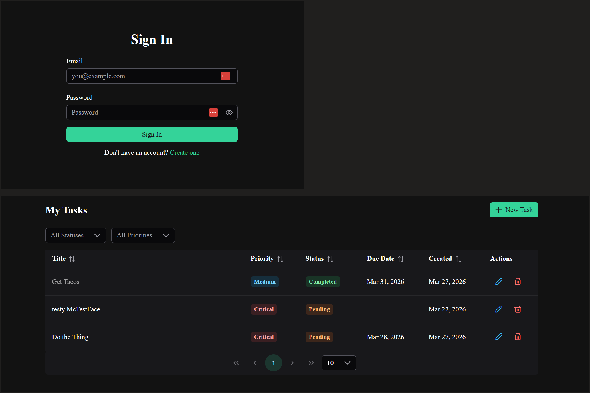

# TaskManager

A full-stack task management app built with .NET 10 and Vue 3. Users can register, log in, and manage their own tasks with filtering, sorting, and pagination. Deployed to Digital Ocean App Platform in a Docker container.

**Live demo:** [https://task-app-y4jp2.ondigitalocean.app](https://task-app-y4jp2.ondigitalocean.app)



## Quick Start

### Prerequisites
- [.NET 10 SDK](https://dotnet.microsoft.com/download)
- [Node.js 20+](https://nodejs.org/)

### Backend

```bash
cd TaskManager.Api
dotnet run
```

The API starts at `http://localhost:5225`. Swagger UI is available at `http://localhost:5225/swagger` for testing endpoints. The SQLite database gets created automatically on first run, migrations are applied at startup.

### Frontend

```bash
cd taskmanager-frontend
npm install
npm run dev
```

The frontend starts at `http://localhost:5173`. Register a new account and you're good to go!

## Tech Stack

- **Backend:** .NET 10, ASP.NET Core Web API, EF Core + SQLite, JWT auth, Serilog, FluentValidation
- **Frontend:** Vue 3 + TypeScript, PrimeVue, Pinia, Axios, Vite
- **Testing:** xUnit, Moq

I went with .NET 10 since it's the current LTS. SQLite over the EF in-memory provider because it's a real relational database that enforces constraints the same way SQL Server or my preferred production db, Postgres, would.

**I have not done much front end engineering for a long time.** Ezra uses Vue and after some research I found that PrimeVue gives you a polished UI fast without spending time on custom CSS. Given that Vue is unfamiliar territory for me, I leveraged AI quite a bit as well as good old Google to find the common patterns and best practices on the front end.

**The backend of the stack is where I live.**  I have included some of the patterns I prefer and you can even checkout my other test repos in my github to see some similarities.  

## Architecture

Single API project with folder-based separation instead of multiple class libraries. Splitting this into Api/Application/Domain/Infrastructure would be the right call for a system with multiple bounded contexts or teams, but that's overkill here.

```
TaskManager.Api/
  Controllers/     API endpoints (AuthController, TasksController)
  Services/        Business logic (AuthService, TaskService)
  Data/            EF DbContext, repositories
  Models/          Entities and enums
  DTOs/            Request/response objects
  Validators/      FluentValidation validators
  Auth/            JWT token service, password hasher
  Middleware/      Global exception handler
  Extensions/      DI registration

TaskManager.Tests/ Unit tests for services and validators
```

The backend is a pretty standard layered approach. Separation of concerns in: Controllers, Services, Repositories. Simple N-Tier style stuff.

The frontend uses Vue's Composition API with Pinia for state management. An Axios instance handles JWT injection and 401 redirects. API calls are wrapped in service functions so components never call Axios directly.

## API Endpoints

Auth endpoints are public. Task endpoints require a valid JWT.

| Method | Endpoint | Description |
|--------|----------|-------------|
| POST | /api/auth/register | Create account, returns JWT |
| POST | /api/auth/login | Login, returns JWT |
| GET | /api/tasks | List tasks (filterable, sortable, paginated) |
| GET | /api/tasks/{id} | Get single task |
| POST | /api/tasks | Create task |
| PUT | /api/tasks/{id} | Update task |
| DELETE | /api/tasks/{id} | Delete task |

The task list endpoint supports query params: `status`, `priority`, `sortBy`, `sortDirection`, `pageNumber`, `pageSize`.

Swagger at `/swagger` when running locally.

## Auth

JWT bearer tokens. BCrypt for password hashing. Registration creates an account and returns a token so the user doesn't have to log in separately. Tasks are scoped to the authenticated user, you can only see and modify your own.

No refresh tokens, no email verification; noted below as future improvements.

## Primary Keys

Using UUID v7 (`Guid.CreateVersion7()`) for primary keys. They're time-ordered, which is better with clustered indexes. For SQLite it doesn't matter much, but if this moved to SQL Server in production it avoids the page split problem you get with random v4 GUIDs.

## Error Handling

Global exception middleware catches unhandled exceptions, logs and returns a generic 500. No stack traces leak to the client. Validation is from FluentValidation.

## Testing

Tests cover the service layer and validators.

## Trade-offs

- **Single project vs. multi-project:**  Folders give the same logical separation without complexity of enterprise DDD style.  Im not really a fan of that style anyway, but having worked in Enterprise environments in the past, it makes things quite organized and maintainable.
- **SQLite over InMemory:** Wanted to implement a real db so data doesn't disappear when restarting.
- **No refresh tokens:** Not really needed for MVP. People can log in again for now.
- **localStorage for JWT:** Better reviewer UX. Production would use httpOnly cookies.

## Patterns and preferences

A few things in here that are just how I prefer to write code.

- **IConfiguration extension methods** instead of magic strings everywhere. `configuration.GetJwtKey()` beats `configuration["Jwt:Key"]` because if the config key changes you fix it in one place. Small thing but it keeps things clean.
- **Implicit operators on DTOs** for entity-to-DTO mapping. `TaskItem` converts to `TaskResponse` automatically without a mapper method or a library like AutoMapper. It's super clean.
- **Tuple returns on service methods**. Keeps things simple without creating a one-off result wrapper class for every operation. 
- **UUID v7 for primary keys** via `Guid.CreateVersion7()`. Time-ordered so they play nice with indexes. Doesn't matter much on SQLite but it's a good habit and if this moved to SQL Server or Postgres in production it avoids index fragmentation from random v4 GUIDs.

## Future Improvements

Things I'd add with more time:

- Refresh token rotation with httpOnly cookies
- Email verification on registration
- Soft deletes instead of hard deletes
- Task categories or tags
- Rate limiting on auth endpoints
- CI/CD pipeline
- Integration tests against a real SQLite database
- Frontend component tests.  Front end is my weakspot.
- Audit logging for task changes
- Task search
